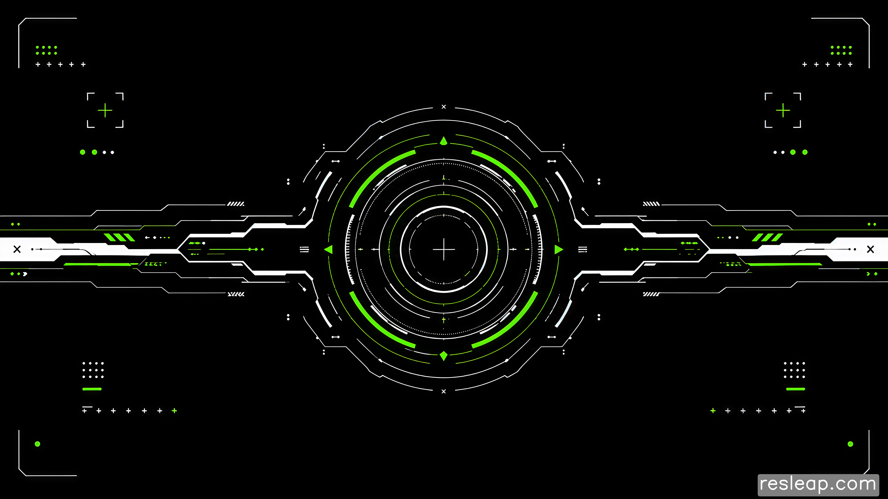

# Hermes WebUI Demo

English | [中文](#中文说明)

Hermes WebUI Demo is a local futuristic control surface for a four-agent Hermes team. It provides a visual dashboard for four configurable local agents, with live agent messaging, Telegram synchronization, WSL command bridging, cron notifications, animated HUD effects, message history, and a clean desktop-style UI.

This repository is a demo-oriented WebUI layer. Real Hermes commands, local history, event logs, cron jobs, and private environment settings are intentionally excluded from the repository.

## Background Preview



## Features

- Four-agent HUD with configurable local agent profiles.
- Local WebUI server with live browser updates.
- Agent input composer with keyboard switching and message bubbles.
- Recent message history per agent.
- Telegram/WebUI synchronization hooks.
- WSL Hermes command bridge through local command configuration.
- Cron reminder and cron task display flow.
- Futuristic background, agent entrance animation, message arrival sound, and optimized SVG/CSS motion effects.
- Example command configuration files for safe setup.

## Quick Start

Requirements:

- Node.js 18 or newer.
- Windows PowerShell or Command Prompt.
- Optional: WSL with Hermes installed, if you want to connect real Hermes agents.

Install dependencies:

```powershell
npm install
```

Start the WebUI:

```powershell
npm run start
```

Then open:

```text
http://127.0.0.1:4173
```

You can also double-click:

```text
start-hermes-webui.cmd
```

## Windows + WSL Hermes Setup

Use this flow if you want the WebUI to talk to real Hermes agents running inside WSL.

1. Download the project.

   Download the latest source zip from:

   ```text
   https://github.com/VannFok/hermes-webui-demo/releases
   ```

   Extract it to a local folder, for example:

   ```text
   D:\CODEX项目\hermes-webui-demo
   ```

2. Install Node.js.

   Install Node.js 18 or newer from:

   ```text
   https://nodejs.org/
   ```

   Check the installation:

   ```powershell
   node -v
   npm -v
   ```

3. Install project dependencies.

   Open PowerShell in the project folder:

   ```powershell
   cd "D:\CODEX项目\hermes-webui-demo"
   npm install
   ```

4. Confirm WSL and Hermes are available.

   Check your WSL distro:

   ```powershell
   wsl -l -v
   ```

   Open your distro and confirm Hermes can run:

   ```powershell
   wsl -d Ubuntu -- bash -lc "hermes --version"
   ```

   If your distro is not named `Ubuntu`, use your actual distro name in later commands.

5. Create the local agent command config.

   ```powershell
   copy hermes-agent-commands.example.json hermes-agent-commands.json
   ```

   The default example maps the four WebUI agents like this:

   ```json
   {
     "commands": {
       "agent-01": {
         "command": "hermes",
         "args": ["run", "--profile", "profile-01"]
       },
       "agent-02": {
         "command": "hermes",
         "args": ["run", "--profile", "profile-02"]
       },
       "agent-03": {
         "command": "hermes",
         "args": ["run", "--profile", "profile-03"]
       },
       "agent-04": {
         "command": "hermes",
         "args": ["run", "--profile", "profile-04"]
       }
     }
   }
   ```

   If your Hermes command or profiles are different, edit this file before starting the WebUI.

6. Start the WebUI.

   For the default `Ubuntu` distro:

   ```powershell
   npm run start
   ```

   If your WSL distro has another name:

   ```powershell
   $env:HERMES_WSL_DISTRO="YourDistroName"
   npm run start
   ```

   You can also set `HERMES_WSL_DISTRO` before double-clicking `start-hermes-webui.cmd`.

7. Open the browser.

   ```text
   http://127.0.0.1:4173
   ```

8. Send the first test message.

   Click an agent name in the top bar, or press `Tab` to switch to the next agent and open the input box.

   Type a short message such as:

   ```text
   hello
   ```

   Press `Enter` to send.

   Expected result:

   - The selected agent enters a typing/running visual state.
   - The center ring animation appears while the agent is running.
   - The reply appears as a message bubble.
   - The latest message is saved into that agent's recent history drawer.

9. Troubleshooting.

   If the WebUI opens but the agent does not reply:

   - Keep the `npm run start` terminal open.
   - Check whether the terminal says `no command configured for ...`.
   - Confirm `hermes-agent-commands.json` exists.
   - Confirm the target Hermes command works inside WSL.
   - Confirm `HERMES_WSL_DISTRO` matches your distro name.

   If the browser cannot open `127.0.0.1:4173`, start the WebUI again:

   ```powershell
   npm run start
   ```

## Connect Real Hermes Agents

Copy one of the example command files:

```powershell
copy hermes-agent-commands.example.json hermes-agent-commands.json
```

Then edit `hermes-agent-commands.json` for your local Hermes/WSL environment.

Private runtime files are ignored by Git:

- `hermes-agent-commands.json`
- `hermes-webui-cron-jobs.json`
- `hermes-webui-history.json`
- `hermes-webui-events.ndjson`
- `hermes-webui-inbox.ndjson`
- `.env*`

## Scripts

```powershell
npm run start
npm run check
npm run test
```

## Release Download

Download the latest packaged source from the GitHub Releases page:

[Releases](https://github.com/VannFok/hermes-webui-demo/releases)

## 中文说明

Hermes WebUI Demo 是一个给四个 Hermes agent 使用的本地未来感控制台。它为四个可配置的本地 agent 提供可视化操作界面，支持实时消息、Telegram 同步、WSL 命令桥接、cron 提醒和任务展示、消息历史、HUD 动效，以及更接近桌面控制台的交互体验。

这个仓库主要是 WebUI demo 层。真实 Hermes 命令、本地历史记录、事件日志、cron 任务和私密环境配置不会上传到仓库。

## 背景图预览


## 功能

- 四个可配置 agent 的顶部控制栏。
- 本地 WebUI 服务，浏览器实时使用。
- Agent 输入框、快捷切换、气泡消息。
- 每个 agent 的最近消息历史。
- Telegram 与 WebUI 同步接口。
- 通过本地命令配置接入 WSL Hermes。
- Cron 提醒与 cron 任务展示流程。
- 未来感背景、agent 出场动画、消息音效、优化后的 SVG/CSS 动效。
- 提供 example 配置文件，避免上传私密运行配置。

## 快速开始

要求：

- Node.js 18 或更新版本。
- Windows PowerShell 或命令提示符。
- 如果要接入真实 Hermes agent，需要 WSL 中已经安装并配置 Hermes。

安装依赖：

```powershell
npm install
```

启动 WebUI：

```powershell
npm run start
```

然后打开：

```text
http://127.0.0.1:4173
```

也可以直接双击：

```text
start-hermes-webui.cmd
```

## Windows + WSL Hermes 接入步骤

如果你希望 WebUI 直接连接 WSL 里的真实 Hermes agent，按下面步骤操作。

1. 下载项目。

   从 GitHub Releases 下载最新源码包：

   ```text
   https://github.com/VannFok/hermes-webui-demo/releases
   ```

   解压到本地目录，例如：

   ```text
   D:\CODEX项目\hermes-webui-demo
   ```

2. 安装 Node.js。

   从 Node.js 官网安装 Node.js 18 或更新版本：

   ```text
   https://nodejs.org/
   ```

   检查安装结果：

   ```powershell
   node -v
   npm -v
   ```

3. 安装项目依赖。

   在 PowerShell 进入项目目录：

   ```powershell
   cd "D:\CODEX项目\hermes-webui-demo"
   npm install
   ```

4. 确认 WSL 和 Hermes 可用。

   查看你的 WSL 发行版名称：

   ```powershell
   wsl -l -v
   ```

   测试 Hermes 是否能在 WSL 中运行：

   ```powershell
   wsl -d Ubuntu -- bash -lc "hermes --version"
   ```

   如果你的 WSL 发行版不叫 `Ubuntu`，后续命令里要换成你的真实发行版名称。

5. 创建本地 agent 命令配置。

   ```powershell
   copy hermes-agent-commands.example.json hermes-agent-commands.json
   ```

   默认示例会把四个 WebUI agent 映射到四个 Hermes profile：

   ```json
   {
     "commands": {
       "agent-01": {
         "command": "hermes",
         "args": ["run", "--profile", "profile-01"]
       },
       "agent-02": {
         "command": "hermes",
         "args": ["run", "--profile", "profile-02"]
       },
       "agent-03": {
         "command": "hermes",
         "args": ["run", "--profile", "profile-03"]
       },
       "agent-04": {
         "command": "hermes",
         "args": ["run", "--profile", "profile-04"]
       }
     }
   }
   ```

   如果你的 Hermes 命令或 profile 名称不同，启动前先修改 `hermes-agent-commands.json`。

6. 启动 WebUI。

   如果 WSL 发行版是默认的 `Ubuntu`：

   ```powershell
   npm run start
   ```

   如果你的 WSL 发行版是其他名称：

   ```powershell
   $env:HERMES_WSL_DISTRO="你的发行版名称"
   npm run start
   ```

   也可以在双击 `start-hermes-webui.cmd` 前先设置 `HERMES_WSL_DISTRO`。

7. 打开浏览器。

   ```text
   http://127.0.0.1:4173
   ```

8. 发送第一条测试消息。

   点击顶部栏里的某个 agent 名称，或者按 `Tab` 切换到下一个 agent 并自动打开输入框。

   输入一条短消息，例如：

   ```text
   hello
   ```

   按 `Enter` 发送。

   预期效果：

   - 被选中的 agent 进入 typing/running 可视状态。
   - agent 运行时中心灯环开始出现并旋转。
   - 回复完成后弹出气泡消息。
   - 最新消息会进入该 agent 的最近历史抽屉。

9. 排查常见问题。

   如果 WebUI 能打开但 agent 没有回复：

   - 保持 `npm run start` 的终端窗口不要关闭。
   - 查看终端是否提示 `no command configured for ...`。
   - 确认 `hermes-agent-commands.json` 已创建。
   - 确认目标 Hermes 命令能在 WSL 中正常运行。
   - 确认 `HERMES_WSL_DISTRO` 和你的 WSL 发行版名称一致。

   如果浏览器打不开 `127.0.0.1:4173`，重新启动 WebUI：

   ```powershell
   npm run start
   ```

## 接入真实 Hermes Agent

复制示例配置：

```powershell
copy hermes-agent-commands.example.json hermes-agent-commands.json
```

然后根据你的本地 Hermes/WSL 环境修改 `hermes-agent-commands.json`。

以下真实运行文件已被 Git 忽略：

- `hermes-agent-commands.json`
- `hermes-webui-cron-jobs.json`
- `hermes-webui-history.json`
- `hermes-webui-events.ndjson`
- `hermes-webui-inbox.ndjson`
- `.env*`

## 常用命令

```powershell
npm run start
npm run check
npm run test
```

## 下载 Release

可以从 GitHub Releases 页面下载最新打包版本：

[Releases](https://github.com/VannFok/hermes-webui-demo/releases)
